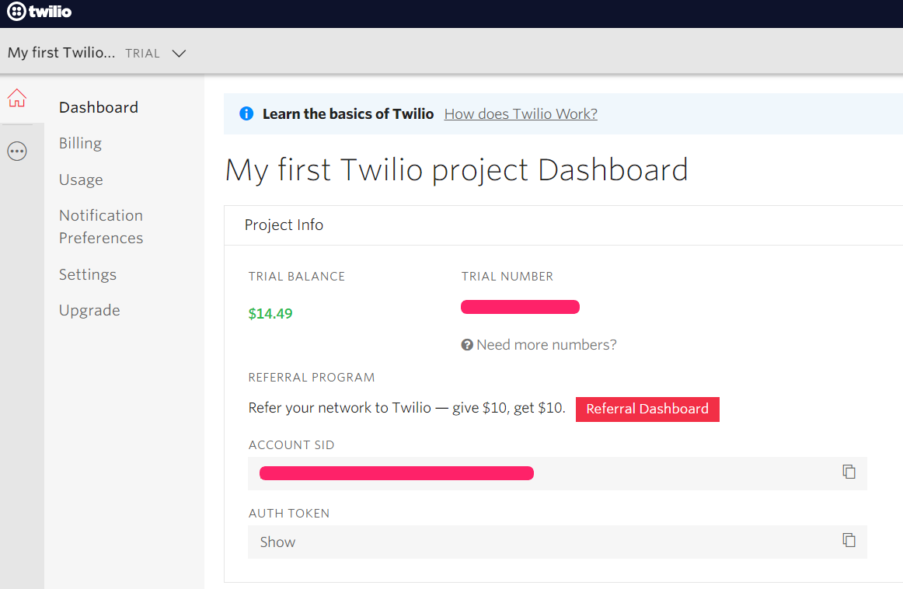

Have you ever wanted to automate your texts to a mate or maybe even your bae? Maybe you want to keep up the illusion you're a responsible adult that definitely has their life together by sending good morning texts first thing! Well, you're in luck! I'm going to walk you through how to send predefined texts on a schedule to whoever you want! 

I've always thought coding should be something fun and flirty to encourage people to learn rather than feeling obligated to learn and thinking it's monotonous or boring. This is a fun little mini project to get your hands dirty with some basic Python and a great API!

First, let's make a directory for our project and create two files: `automate_texting.py` and `twilio_credentials.py`. We want to keep any confidential information like keys and tokens in the credentials file, which you should never upload anywhere like GitHub. Instead, you'll just be running this program locally, but it's still a good idea to get into the habit of separating out this kind of information from where it's used in the code. Your `twilio_credentials.py` file should look something like this, just with your own credentials filled in instead:

<svg xmlns="http://www.w3.org/2000/svg" width="54" height="14" viewBox="0 0 54 14"><g fill="none" fill-rule="evenodd" transform="translate(1 1)"><circle cx="6" cy="6" r="6" fill="#FF5F56" stroke="#E0443E" strokeWidth=".5"></circle><circle cx="26" cy="6" r="6" fill="#FFBD2E" stroke="#DEA123" strokeWidth=".5"></circle><circle cx="46" cy="6" r="6" fill="#27C93F" stroke="#1AAB29" strokeWidth=".5"></circle></g></svg>

twilio_credentials.py

<pre class="result">
cellphone = ""
twilio_number = ""
twilio_account = ""
twilio_token = ""
</pre>

 

Let's go ahead and head over to [Twilio](https://www.twilio.com/) and either create a trial account or sign in to your existing account if you've used their services before. Be sure you verify your own phone number during your account setup, this is so we can send any test texts to our own phone while we develop. On the console page, you should see a red button near the top to create a **trial number**, click this and make note of what we'll refer to as your `twilio_number` this will essentially be your 'from' phone number. Just below here you'll see your **account SID**, this is what will be your `twilio_account` in your credentials file, and your **auth token** is your `twilio_token`. Fill all this information in within your credentials file and then we can get cracking!

Now let's open up our `automate_texting.py` file, our first step is to have a think about what we want our texts to say and create a list of those predetermined texts in a variable called `GOOD_MORNING_QUOTES`:

<svg xmlns="http://www.w3.org/2000/svg" width="54" height="14" viewBox="0 0 54 14"><g fill="none" fill-rule="evenodd" transform="translate(1 1)"><circle cx="6" cy="6" r="6" fill="#FF5F56" stroke="#E0443E" strokeWidth=".5"></circle><circle cx="26" cy="6" r="6" fill="#FFBD2E" stroke="#DEA123" strokeWidth=".5"></circle><circle cx="46" cy="6" r="6" fill="#27C93F" stroke="#1AAB29" strokeWidth=".5"></circle></g></svg>

automate_texting.py

<pre class="result">
GOOD_MORNING_QUOTES = [
    "Good morning!",
    "Rise and shine!",
    "I'm definitely not still sleeping...."
]
</pre>

 

You can add as many as you want! Next, we'll start creating our function that will collect all our credentials with Twilio along with our quotes array and pick one at random to send to the phone number we defined in `cellphone`:

<svg xmlns="http://www.w3.org/2000/svg" width="54" height="14" viewBox="0 0 54 14"><g fill="none" fill-rule="evenodd" transform="translate(1 1)"><circle cx="6" cy="6" r="6" fill="#FF5F56" stroke="#E0443E" strokeWidth=".5"></circle><circle cx="26" cy="6" r="6" fill="#FFBD2E" stroke="#DEA123" strokeWidth=".5"></circle><circle cx="46" cy="6" r="6" fill="#27C93F" stroke="#1AAB29" strokeWidth=".5"></circle></g></svg>

automate_texting.py

<pre class="result">
GOOD_MORNING_QUOTES = [
    "Good morning!",
    "Rise and shine!",
    "I'm definitely not still sleeping...."
]

def send_text(quote):
    account = twilio_account
    token = twilio_token
    client = Client(account, token)
    quote = GOOD_MORNING_QUOTES[random.randint(0, len(GOOD_MORNING_QUOTES)-1)]

    client.messages.create(to=cellphone,
                           from_=twilio_number,
                           body="quote)
</pre>

 

If you have a keen eye or some previous experience with Python, you'll notice something's a little off with our code here. We're trying to make use of API's without having installed them! At the top of that file let's add the following:

<svg xmlns="http://www.w3.org/2000/svg" width="54" height="14" viewBox="0 0 54 14"><g fill="none" fill-rule="evenodd" transform="translate(1 1)"><circle cx="6" cy="6" r="6" fill="#FF5F56" stroke="#E0443E" strokeWidth=".5"></circle><circle cx="26" cy="6" r="6" fill="#FFBD2E" stroke="#DEA123" strokeWidth=".5"></circle><circle cx="46" cy="6" r="6" fill="#27C93F" stroke="#1AAB29" strokeWidth=".5"></circle></g></svg>

automate_texting.py

<pre class="result">
from twilio.rest import Client
from twilio_credentials import cellphone, twilio_account, twilio_token, twilio_numner
import schedule, random, time

GOOD_MORNING_QUOTES = [
    "Good morning!",
    "Rise and shine!",
    "I'm definitely not still sleeping...."
]

def send_text(quote):
    account = twilio_account
    token = twilio_token
    client = Client(account, token)
    quote = GOOD_MORNING_QUOTES[random.randint(0, len(GOOD_MORNING_QUOTES)-1)]

    client.messages.create(to=cellphone,
                           from_=twilio_number,
                           body="quote)
</pre>

 

We also need to install these locally with `pip3`:

<svg xmlns="http://www.w3.org/2000/svg" width="54" height="14" viewBox="0 0 54 14"><g fill="none" fill-rule="evenodd" transform="translate(1 1)"><circle cx="6" cy="6" r="6" fill="#FF5F56" stroke="#E0443E" strokeWidth=".5"></circle><circle cx="26" cy="6" r="6" fill="#FFBD2E" stroke="#DEA123" strokeWidth=".5"></circle><circle cx="46" cy="6" r="6" fill="#27C93F" stroke="#1AAB29" strokeWidth=".5"></circle></g></svg>

> pip3 install twilio

> pip3 install schedule

>

 

Awesome! Now we have the Twilio part of our little app setup, now all we have to do is define a schedule! We'll use `schedule` to do that, you can read up on the docs [here](https://schedule.readthedocs.io/en/stable/). If you have a look at the usage section, you can see the different options you have for automating your texts. For this example, we'll use the daily option `schedule.every().day.at("10:30").do(job)`. I love how self explanatory this API is 😻. We're just going to adjust our time to `"06:01"` to make it look like we're an early riser and the receiver is the first thing on our mind 😉 we also need to replace the `job` function with our own `send_text`. Make sure you add this line outside our `send_text` function definition, we don't want it to be part of the function and try to call it at the same time! 
And that's very nearly it! We're going to create an infinite loop (don't worry! It's ok in this situation, I think? HA!) using `while True:` to check for any scheduled text is pending and to run it. At the bottom of your script add this loop:

<svg xmlns="http://www.w3.org/2000/svg" width="54" height="14" viewBox="0 0 54 14"><g fill="none" fill-rule="evenodd" transform="translate(1 1)"><circle cx="6" cy="6" r="6" fill="#FF5F56" stroke="#E0443E" strokeWidth=".5"></circle><circle cx="26" cy="6" r="6" fill="#FFBD2E" stroke="#DEA123" strokeWidth=".5"></circle><circle cx="46" cy="6" r="6" fill="#27C93F" stroke="#1AAB29" strokeWidth=".5"></circle></g></svg>

automate_texting.py

<pre class="result">
from twilio.rest import Client
from twilio_credentials import cellphone, twilio_account, twilio_token, twilio_numner
import schedule, random, time

GOOD_MORNING_QUOTES = [
    "Good morning!",
    "Rise and shine!",
    "I'm definitely not still sleeping...."
]

def send_text(quote):
    account = twilio_account
    token = twilio_token
    client = Client(account, token)
    quote = GOOD_MORNING_QUOTES[random.randint(0, len(GOOD_MORNING_QUOTES)-1)]

    client.messages.create(to=cellphone,
                           from_=twilio_number,
                           body="quote)

schedule.every().day.at("06:01").do(send_text, GOOD_MORNING_QUOTES)

while True:
    schedule.run_pending()
    time.sleep(2)
</pre>

 

You can run your script locally by running `python3 automate_texting.py` in your command line, it'll run until your scheduled time and will then send a random text you defined 😀 It'll run continuously until you stop it actually, since we setup the schedule for every day! If you have any errors or invalid numbers attached to your script, it'll error and tell you why along with a helpful link to their docs for that particular error. 

# Troubleshooting

⚪ Some errors I had pertained to the format of the phone numbers, be sure you follow this format: **+1(areacode)(number)**. 

⚪ If you're only using a trial Twilio account, you must use the phone number provided by Twilio as your 'from' number, and your personal phone number that you verified with them as your 'to' number. You can verify more phone numbers with them to send to other people, but you're still limited to the free $15 they supplied with your trial account. To take this beyond their limitations you'll want to upgrade your account!