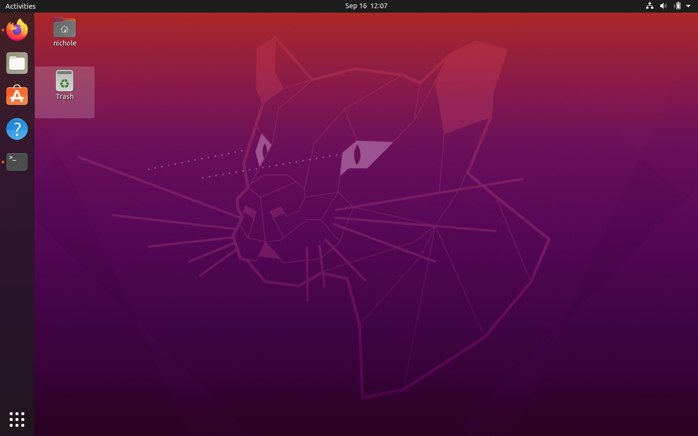
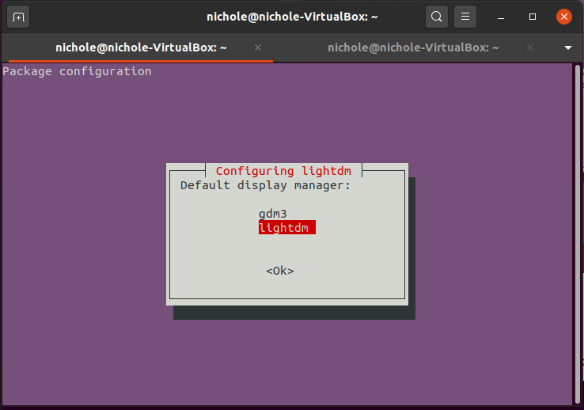
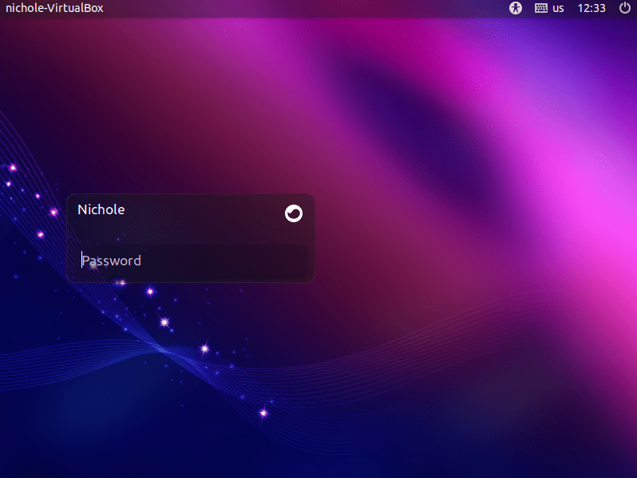
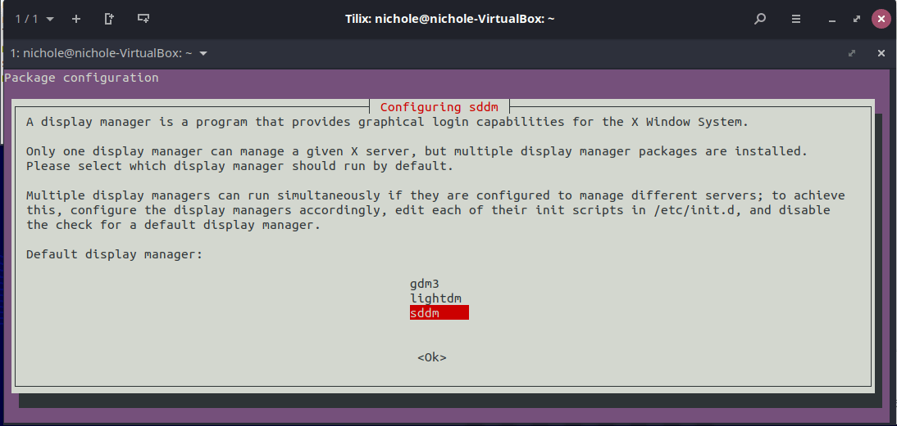
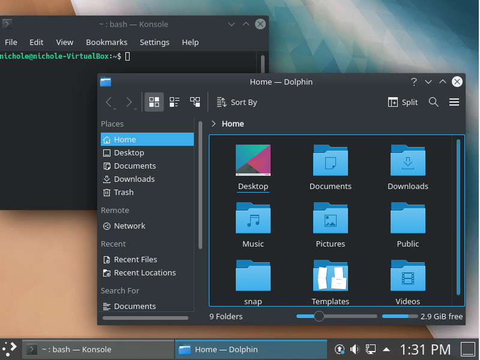

Your Linux distribution, no matter which flavor you have, comes with its own default desktop environment. A desktop environment provides the look and feel of the GUI you're using, everything from the display manager down to the icons and panel! They're also fairly customizable so you can swap out your default for something you fancy more or even modify an existing desktop environment to your liking. We'll only be covering changing your desktop environment to another existing one in this post. 

Before we begin, a small note about installing multiple desktop environments! **Warning!** They may conflict with each other and cause glitches, it may be small issues such as missing icons and other UI issues which are easily fixable - or it could cause larger issues that interfere with your productivity. From my experience, I've only encountered an issue with changing my resolution with too many desktop environments being installed, my settings were shown appropriately but could not be saved.

## Getting started with Budgie!
Now to begin! I'll be using Ubuntu as my distribution of choice for this example, only for that it's one of my favorites! Feel free to use whatever distro you want, but do some research before choosing a new desktop environment as not everything is compatible with every distro! I'll be using GNOME 3/GNOME Shell, Budgie, and KDE (Standard) which are all compatible with Ubuntu 20.04.1.

If you're curious as to which desktop environment you're using right now, spin up a terminal session and enter the following command: `echo $XDG_CURRENT_DESKTOP`. For me, this is what my results look like:

<svg xmlns="http://www.w3.org/2000/svg" width="54" height="14" viewBox="0 0 54 14"><g fill="none" fill-rule="evenodd" transform="translate(1 1)"><circle cx="6" cy="6" r="6" fill="#FF5F56" stroke="#E0443E" strokeWidth=".5"></circle><circle cx="26" cy="6" r="6" fill="#FFBD2E" stroke="#DEA123" strokeWidth=".5"></circle><circle cx="46" cy="6" r="6" fill="#27C93F" stroke="#1AAB29" strokeWidth=".5"></circle></g></svg>

> echo $XDG_CURRENT_DESKTOP
<pre class="result">
ubuntu:GNOME
</pre>
>

 

This is what the Gnome Shell desktop environment looks like by default on my Ubuntu distro:

To have a clean slate to get started, we're going to go ahead and update and upgrade apt:

<svg xmlns="http://www.w3.org/2000/svg" width="54" height="14" viewBox="0 0 54 14"><g fill="none" fill-rule="evenodd" transform="translate(1 1)"><circle cx="6" cy="6" r="6" fill="#FF5F56" stroke="#E0443E" strokeWidth=".5"></circle><circle cx="26" cy="6" r="6" fill="#FFBD2E" stroke="#DEA123" strokeWidth=".5"></circle><circle cx="46" cy="6" r="6" fill="#27C93F" stroke="#1AAB29" strokeWidth=".5"></circle></g></svg>

> sudo apt update && sudo apt upgrade

 

We're going to start with Budgie, it has a cute name and it's a cute desktop environment! It's pretty user friendly, very mondern and elegant, and is available for all major Linux distros. Honestly the only thing I'd change is the theme of the windows, which I believe is something you can do with some configuration. Just a note that downloading everything for any desktop environment is a bit of a lengthy wait! Don't be alarmed by this!

<svg xmlns="http://www.w3.org/2000/svg" width="54" height="14" viewBox="0 0 54 14"><g fill="none" fill-rule="evenodd" transform="translate(1 1)"><circle cx="6" cy="6" r="6" fill="#FF5F56" stroke="#E0443E" strokeWidth=".5"></circle><circle cx="26" cy="6" r="6" fill="#FFBD2E" stroke="#DEA123" strokeWidth=".5"></circle><circle cx="46" cy="6" r="6" fill="#27C93F" stroke="#1AAB29" strokeWidth=".5"></circle></g></svg>

> sudo apt install ubuntu-budgie-desktop

 

Once it's all downloaded, you'll get a prompt to choose your display manager. You're going to want to select `lightdm` for Budgie.

After the install, you're going to need to reboot your machine. You'll then be greeted by a new login screen! You'll also see a new icon, this is where you'll go to change which desktop environment you'd like to use for that session from a list of currently installed options.

## Troubleshooting
At this point, you may be struggling (I was!). There was no end to the errors I ran into just to get my first desktop environment installed. I finally found a path through it though, it's not fool-proof! To be quite honest for the Budgie install, it took 3 attempts at running the install command because of connection issues (but were they really connection issues? 🤔)

If you're having issues with `apt update/upgrade/install` commands such as connection failed or missing and broken packages give this a try:

<svg xmlns="http://www.w3.org/2000/svg" width="54" height="14" viewBox="0 0 54 14"><g fill="none" fill-rule="evenodd" transform="translate(1 1)"><circle cx="6" cy="6" r="6" fill="#FF5F56" stroke="#E0443E" strokeWidth=".5"></circle><circle cx="26" cy="6" r="6" fill="#FFBD2E" stroke="#DEA123" strokeWidth=".5"></circle><circle cx="46" cy="6" r="6" fill="#27C93F" stroke="#1AAB29" strokeWidth=".5"></circle></g></svg>

> sudo rm -r /var/lib/apt/lists/*

> sudo apt-get clean

> sudo apt-get update

 

After running those commands, try to install your desktop environment again.

## Installing KDE like a Kool-Kid

### KDE-full
You have a few options when it comes to installing KDE, there's the full version which contains everything with all the dependencies and apps (complete package and KDE Plasma Desktop). Because it's the complete pack, it's fairly large (around 1GB) and will take some time to download and install.

<svg xmlns="http://www.w3.org/2000/svg" width="54" height="14" viewBox="0 0 54 14"><g fill="none" fill-rule="evenodd" transform="translate(1 1)"><circle cx="6" cy="6" r="6" fill="#FF5F56" stroke="#E0443E" strokeWidth=".5"></circle><circle cx="26" cy="6" r="6" fill="#FFBD2E" stroke="#DEA123" strokeWidth=".5"></circle><circle cx="46" cy="6" r="6" fill="#27C93F" stroke="#1AAB29" strokeWidth=".5"></circle></g></svg>

> sudo apt install kde-full

 

### KDE-standard
The standard version comes with the KDE Plasma Desktop and a standard set of apps such as Kate, Konqueror, Dolphin, and more.

<svg xmlns="http://www.w3.org/2000/svg" width="54" height="14" viewBox="0 0 54 14"><g fill="none" fill-rule="evenodd" transform="translate(1 1)"><circle cx="6" cy="6" r="6" fill="#FF5F56" stroke="#E0443E" strokeWidth=".5"></circle><circle cx="26" cy="6" r="6" fill="#FFBD2E" stroke="#DEA123" strokeWidth=".5"></circle><circle cx="46" cy="6" r="6" fill="#27C93F" stroke="#1AAB29" strokeWidth=".5"></circle></g></svg>

> sudo apt install kde-standard

 

### KDE-pasma-desktop
This version is the minimal version of KDE, only containing the Plasma Desktop. No apps come with this by default although you can install them later. This is definitely the option you want if you're just wanting to give KDE a try.

<svg xmlns="http://www.w3.org/2000/svg" width="54" height="14" viewBox="0 0 54 14"><g fill="none" fill-rule="evenodd" transform="translate(1 1)"><circle cx="6" cy="6" r="6" fill="#FF5F56" stroke="#E0443E" strokeWidth=".5"></circle><circle cx="26" cy="6" r="6" fill="#FFBD2E" stroke="#DEA123" strokeWidth=".5"></circle><circle cx="46" cy="6" r="6" fill="#27C93F" stroke="#1AAB29" strokeWidth=".5"></circle></g></svg>

> sudo apt install kde-plasma-desktop

 

Again, once everything is downloaded you'll be presented with a prompt to choose the display manager. You'll want to select SDDM, Simple Desktop Display Manager, here for the KDE Desktop. Then reboot and explore your new desktop environment!

Unfortunately for me, this is where my VM started acting up and having issues with the desktop environment. So I didn't quite get the full KDE experience but here's a look at what my environment looked like with the terminal and Dolphin file manager open. This is also where I experienced issues with resolution, but swapping back to GNOME Shell or Budgie works flawlessly still!

It's way more beautiful in other screenshots I've seen online, plus I like how you can beautify it even more. I'll be spinning up a new VM just to try to reinstall KDE properly and see what I can do to customize it to my liking as well. Come back later for a new post on that if you're interested! Otherwise...

# ✨
