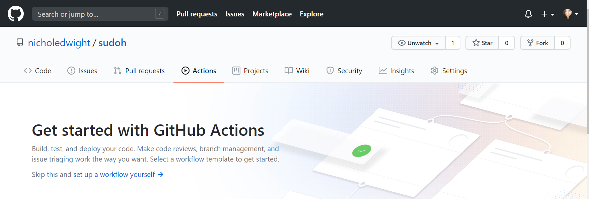
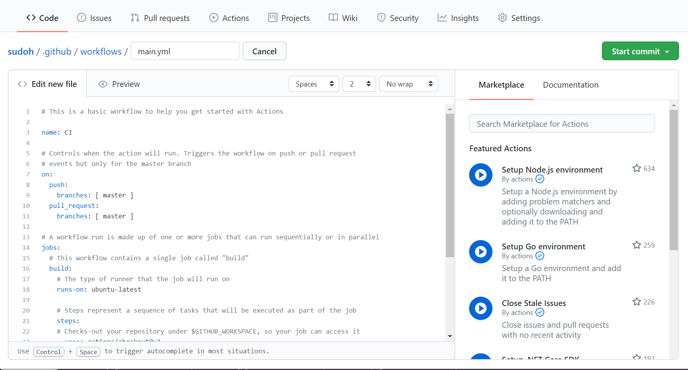

In the previous post, we had a look at how to deploy our Gatsby static website to an AWS S3 bucket, in this post we'll learn how to automate that deployment on push using Github Actions.

Github Actions is a feature that allows you to use serverless resources to build binaries, automate tests, execute deployments, or even just run Linux commands without having to use servers.

**From here on out, I'm assuming you know how and have pushed your project to a repository on Github.**

There are two ways to get started with Github Actions, my preferred way is through the **Actions** tab on my repository on Github, the second way is adding the workflow file directly to the repo itself.

You should also see a **Get Started** button on this page if you have not previously setup Github Actions in your repo. Go ahead and skip this and instead we're going to be *set up a workflow yourself*

You should now see an example template for your YAML workflow file in the editor. You can rename the file to *production.yml* if you'd like or just leave it as is. If you'll be deploying staging or dev environments, it's a good idea to rename your YAML files appropriately. Click **Start commit** and go back to your project tp *pull* the latest change.

