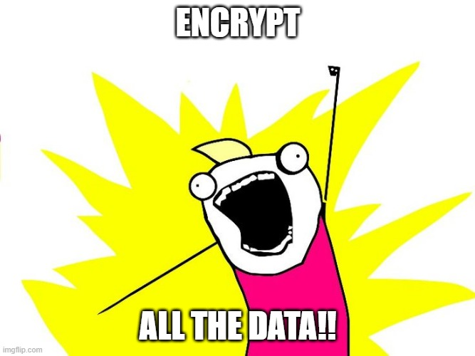

## Welcome!

This is the first installment of a series I'll be writing for studying for the Security+ exam! Follow along with me in my 'explain it like I'm 5' notes on all the exam objectives! The intent of this series is to help you (and myself) review for the Security+ exam, please don't take these notes as an end-all, be-all. These are just a guide with mildly in-depth discussion of the exam objectives, I highly encourage you to take these notes as a framework for your own further study! Go read up more on everything in here, especially anything you find particularly interesting! (*ahem* steganography anyone?!)

`Note: These posts are in no means meant to be bite-sized content, these will be as detailed and long as I can reasonably make them without writing a whole post on each objective`

Anyway, here we go!

## CIA and AAA

I want to begin here because it's absolutely fundamental to understand the concepts here before proceeding to methods and other concepts that protect and uphold CIA. 
#### CIA stands for `Confidentiality`, `Integrity`, and `Availability`.

- Confidentiality - At its core, confidentiality is all about preventing an unauthorized disclosure of data.

- Integrity - This refers to our data being unchanged. We know the integrity of our data is good when we can ensure and prove our data has not been changed, modified, or altered in any manner by any unauthorized people. This could occur from unauthorized users, malicious software, and through system and human errors.

- Availability - Our data and services need to be available whenever access is requested, even if someone is currently attacking! We'll talk more about this in depth soon, but a good way of ensuring availability of data is by making use of redundancy and fault-tolerancy.

#### AAA stands for `Authentication`, `Authorization`, and `Accounting`.

- Authentication - This is all about the verification of someone's identity. Are you really who you say you are? This happens *all. the. time* in you everyday life, when you login to social media accounts, when you enter your pin at checkout, when you visit a bank, etc. We'll talk a lot more about this soon when we get to digital signatures and the concept of non-repudiation.

- Authorization - This goes hand-in-hand with authentication, it's generally what follows immediately after authentication, you are given access to the data. Say you are authenticated into your Twitter account, you are then authorized to tweet from that account. If you've ever worked in a fairly commercial building, you have an ID badge which authenticates you as a valid employee, after scanning it you are then authorized access to the rest of the building.

- Accounting - We're not exactly talking about tracking finances here, but it's a good way to explain the concept! Accounting is just that, taking account or recording everything that has happened on our watch. Think about monitoring logs here. By making use of accounting, we're able to create a good baseline for what ~normal~ activity looks like within our systems.

## Use Case

A `use case` has a few definitions, it describes a goal that an organization wants to achieve, engineers use it in systems analysis and software development to identify and clarify requirements to achieve the goal. Say we're making an online order, "Place Order" would be our use case and it would involve many moving parts! Let's go over the structure of what makes up a use case.

- Actors - We, or whoever is purchasing this, would be an actor. We might have an account and be a registered user with the website and have our shipping and billing information already inputted into their database. We may be a new customer and our information still needs to be collected. Other actors would include the `billing system` and the `fullfillment system` that processes and ships the order.

- Precondition - This is something that must occur before the process can start. So we would need to select an item to purchase before we can even place the order.

- Trigger - This is what will start our use case. So when we click on the shopping cart to begin the purchase process, this action is the trigger.

- Postcondition - This is what will occur after the actor triggers the process. Our order will be put into the system after we complete our puchase. We'll then receive an acknowledgement of our order, billing may then take additional steps to bill us, and shipping will also take steps to ship us the product.

- Normal Flow - A use case will typically list each of the steps in a specific order. In our example, we might see a dozen steps that start when we pick an item to order and end when we complete the order and exit the purchasing system or website.

- Alternate Flow - Not all purchases on this site will be the same. Instead of using existing billing and shipping information, we might want to use a different address or a different credit card than what's already in the system. It's also possible for us to change our mind and abandon the process before completeing the purchase or even cancel *after* we've completed the purchase. 

## Confidentiality

Remember just a few minutes ago where we were talking about CIA? Well I wasn't lying when I said it was important! We're going to talk more about confidentiality here. As a recap, at its core, it's about preventing unauthorized disclosure of data. We can ensure the confidentiality of our data by using different methods - `encryption`, `access controls`, `steganography and obfuscation`, and more! 

#### Encryption

Encryption scrambles our data so it's no longer readable by unauthorized personnel. For example, you need to transmit Personally Identifiable Information (`PII`), such as medical or credit card information via an email. Once you click send on that email you're no longer in control of that data, hence you'll want to encrypt the email before you send it in order to protect the confidentiality of that data. We'll cover this a lot more in a few more chapters but this is just the base understanding you need for now.

#### Access Controls

Identification, Authentication, and Authorization combined provide access controls and help ensure confidentiality of data. You can use access controls to grant and restrict access to individual people. For example: 

- Identification - Users claim their identity by using a unique username

- Authentication - Users then prove their identity with authentication, such as a password

- Authorization - Then, we're able to either grant or restrict their access to resources using an authorization method, such as permissions.

#### Steganography and Obfuscation

`Steganography` is the practice of hiding data within data, otherwise known as hiding data in plain sight. By obscuring the data, it can be used in a use case to support obfuscation (which we'll cover more in depth in another chapter! Again, just the basics here.) `Obfuscation` methods attempt to make something unclear or difficult to understand. We call it 'Security by obscurity', but do keep in mind that this is not a reliable method of maintaining security! Attackers are smart!

You can embed a hidden message in an image by modifying certain bits within the file. If people know what to look for, they'll be able to retrieve the message! Otherwise, they won't be any wiser. Using software like WinRAR you can take a `Cover File` and your `Secret Message` and combine them through a `Steganographic Encoder` which will produce a `Stego Object` which will look *very* similar to your original cover file, with no visible changes, but it will have our secret message embedded! To retrieve the secret message, our Stego Object is then fed into a `Steganographic Decoder`. Does anyone else keep thinking about stegosauruses? 

At this point, you might be wondering how steganography is different from cryptography. Cryptography actually changes the information to ciphertext, modifying the data structure of the original information, which can't be understood without a decryption key. Steganography doesn't change the format of the information, it only conceals the existence of the message within. Steganography is more discreet than cryptography, however, once the existence of the secret message is known it's much easier to extract that information than it would be if it were encrypted with cryptography.

There are so many different kinds of steganography, and I highly encourage you to research them! But one I found really interesting and relevant to the Security+ is `network steganography`. This is the technique of embedding information within network control protocols used in data transmission such as TCP, UDP, ICMP, etc. You can hide information in the header of a TCP/IP packet in some of the optional fields! How cool is that?

Some cool facts about the origination and background of steganography! It stems from two Greek words, `steganos` meaning 'covered' and `graphia` meaning 'writing'. The first use of steganography is traced back to 440 BC when ancient Greece people wrote messages on wood and covered it with wax. Romans used various forms of invisible inks, and in order to decipher those messages they used light or heat. One sehr cool fact is that in WW2 the Germans introduced microdots, which were COMPLETE documents, pictures, or plans reduced to the size of a dot and attached to normal paperwork 🤯

## Integrity

#### Hashing

Hashing enforces integrity. This can be done through a few different methods

    - MD5 - Message Digest 5
    - SHA - Secure Hash Algorithm
    - HMAC - Hash-based Message Authentication Code

A `hash` is a number created by executing a hashing algorithm against data, such as a file or message. If the data never changes, the resulting has will ALWAYS be the same. If the hash does not match the source hash or a previous known good hash, it could mean the data has been modified by an attacker, corrupted, or simply updated by a valid source. Hashing cannot tell you what modified the data, only that it has changed, and if it's changed then it implies the data *should not be trusted*. 

## Digital Signatures

Remember, I mentioned we'd be discussing this back in the Authentication section? A lot of things relevant to security will overlap with each other -- just wait until we get into access control classifications! I like to think of the overlap as covering all the gaps, we make sure there isn't a gaping hole in our knowledge we don't know about that attackers could use!

Anyway, digital signatures provies authentication, if the signature is intact, it authenticates the sender. We can use it to prevent attackers from impersonating others and sending malicious emails. This also provides `non-repudiation`, which means someone cannot later deny sending an email for example, because the digital signature proves they did. You can also relate this to audit logs and Linux systems, in each every user is assigned a username and creates their own unique password that no one else should know. This alone with monitoring their activities provides an environment with non-repudiation, if an employee logs into the system and does something nefarious, there's a papertrail to prove it was them!

Digital signatures require the use of certificates and a Public Key Infrastructure (`PKI`). Certificates include keys used for encryption and the PKI provides the means to create, manage, and distribute certificates.

## Availability

Recap: Availability means data and services are available whenever needed, even in the middle of an attack. I talked a little before about how redundancy and fault-tolerancy can help ensure availability. Let's go into that a little more

- Fault-tolerance - If a system has a fault, the duplication provided by redundancy allows that system to continue without interruption. A single fault should not bring down the entire system.

- Redundancy - this adds duplication to critical systems and provides fault-tolerance. 
    

- SPOF - Single point of failure, if this fails, the entire system can fail. For example, if a server has a single drive, the drive is the SPOF because its failure takes down the server. Try to avoid this.

- Disk redundancies - These are fault-tolerant disks such as RAID-1 (mirroring), RAID-5 (striping with parity), and RAID-10 (striping with a mirror) allow a system to continue to operate even if a disk fails.

- Server redundancies - Failover clusters include redundant servers and ensure a service will continue to operate, if with a failure. Virtualization can also increase availability of servers by reducing unplanned downtime.

- Load balancing - uses multiple servers to support a single service, such as a high volume website.

- Site redundancies - If a site can no longer operate to a natural disaster or destruction, the org can move critical systems to an alternate site. Alternate site can be a hot site (ready and available 24/7), a cold site (location where equipment, data, and personnel can be moved to when needed), or a warm site (a compromise between hot and cold sites)

- Backups - If personnel backup important info, it can be restored should originals be lost.

- Alternate power - uninterruptible power supplies (UPSs) and power generators can provide power to key systems 

- Cooling systems - Heating, ventilation, and air conditioning improve the availability of systems by reducing outages from overheating

## Resource vs Security Constraints

So, we know encryption is awesome and helps protect the confidentiality of our data. Why not just encrypt ALL THE DATA if that's the best? Well, say we have a message that is 260 characters, after we encrypt it that message would be about 360 characters. That's a 40% increase, which means if we were to encrypt absolutely everything, companies would need to invest in about 40% more disk space to store that encrypted data. Not only that, processing it also consumes more memory. Company executives need to focus on cost of a business, and maintaining profitability. So they need to work with security professionals to find a good common ground and compromise cost and security, it's all about balance. 

## Risk Concepts

`Risk` is the possibility or likelihood of a threat exploiting a vulnerability, resulting in a loss or corruption of data. A `threat` is any circumstance or event that has the potential to compromise confidentiality, integrity, or availability. A `vulnerability` is a weakness, this could be a weakness in the hardware, software, configuration, or even the users' own operating system (`OS`).

If a threat, such as an attacker, exploits a vulnerability, it can result in a security incident. A `security incident` is an adverse event or series of events that can negatively affect the CIA of an organization's IT systems and data.

## Risk Mitigation

Risk mitigation reduces chances that a threat will exploit a vulnerability. We can reduce risks by implementing controls, also called countermeasures and safeguards.

## Technical Controls

These are classified by using technology to reduce vulnerabilities. A few of them include:

    - Encryption
    - Antivirus Software
    - Intrusion Detection Systems (IDSs) and Intrustion Prevention Systems (IPSs)
    - Firewalls
    - Least Privilege - make sure personnel only are given the permissions for what they need to accomplish their jobs, no more!

## Administrative Controls

These use methods mandated by organizational policies or other guidelines. Management may require personnel to periodically complete assessments and tests to reduce and manage risk.

- Risk assessments - help quantify and qualify risks within an organization, so the organization can focus on the serious risks

- Vulnerability assessments - attempts to discover current vulnerabilities or weaknesses

- Penetration tests - this is a step further than vulnerability assessments because in pen tests we also attempt to exploit the vulnerabilities found

## Operational Controls

These still fall under administrative controls. Operational Controls help ensure that day-to-day operations of an organization comply with the organization’s overall security plan. People (not technology) then implement these controls.

- Awareness and training

- Configuration and change management - configuration management often uses baselines to ensure that systems start in a secure, hardened state. Change management helps ensure that changes don’t result in unintended configuration errors.

- Contingency planning - goal is to reduce the overall impact on the org if an outage occurs

- Media protection - media includes physical media such as USB flash drives, external and internal drives, and backup tapes

- Physical and environmental protection

## Physical Controls

These are controls you can *touch*: lighting, signs, fences, cameras, door locks, heating, ventilation systems, security guards, and more. A fire suppression system (and others) are also technical controls, you can physically touch them but they also use technologies to detect, suppress, or extinguish fires.

## Control Goals

Technical and administrative controls categorize controls based on how they’re implemented. Another way of classifying security controls is based on their goals in relationship to security incidents. Common ones are: 

    - preventative
    - detective
    - corrective
    - deterrent
    - compensating

## Preventative Controls

These are meant to prevent security incidents.

- Hardening - practice of making a system or application more secure than its default configuration. Uses a defense-in-depth strategy with layered security. Includes disabling unnecessary ports and services, implementing secure protocols, using strong passwords along with a robust password policy, and disabling default and unnecessary accounts. Reduce attack surface!

- Security awareness and training

- Security Guards

- Change management - ensures that changes don’t result in unintended outages. If administrators making changes on the fly, they submit the change to a change management process. This is an operational control, which attempts to prevent incidents.

- Account disablement policy - ensures user accounts are disabled when an employee leaves.

## Detective Controls

These attempt to detect when vulnerabilities have been exploited, resulting in a security incident. 

- Log monitoring

- Trend analysis - monitor logs to detect trends. Eg: an intrusion detection system (IDS) attempts to detect attacks and raise alerts or alarms. By analyzing past alerts, you can identify trends, such as an increase of attacks on a specific system

- Security audit - periodic reviews of password policies, user rights to see if anyone has more permissions than they need, etc.

- Video surveillance - can also be used as a deterrent control

- Motion detection

## Corrective Controls

These attempt to reverse the impact of an incident or problem after it has occurred. 

- IPS - Intrusion prevention system attempts to detect attacks and then modify the environment to block the attack from continuing.

- Backups and system recovery

## Deterrent Controls

These attempt to discourage a threat. You can alsodescribe many of them as preventative controls as well.

- Cable locks

- Hardware locks - other locks such as locked doors securing a wiring closet or server room

## Compensating Controls

These are alternative controls used instead of a primary control. An org might require employees to use smart cards when authenticating on a system. However, it might take a bit for new employees to get their smart card, to allow them to access the network and still maintain a high level of security, the org might choose to implement a Time-based One-Time Password (`TOTP`) as a compensating control. Compensating controls still provide strong authentication solutions.

## Hypervisors

`Virtualization` allows you to host one or more virtual systems, or virtual machines (`VM`) on a single physical system.

A `hypervisor` is the software that creates, runs, and manages the VMs.

- Type I - run directly on the system hardware, often called bare-metal hypervisors because they don’t need to run within an OS. VMware has a family of ESX/ESXi products that are Type I hypervisors.

- Type II - run as software within a host OS.

- Application cell virtualization or container virtualization runs services or applications within isolated application cells (or containers). Containers don’t host an entire OS, instead the host’s OS and kernel run the service or app within each of the containers.

- Container virtualization uses fewer resources and can be more efficient than a system using a traditional Type II hypervisor virtualization. Containers MUST use the OS of the host though
