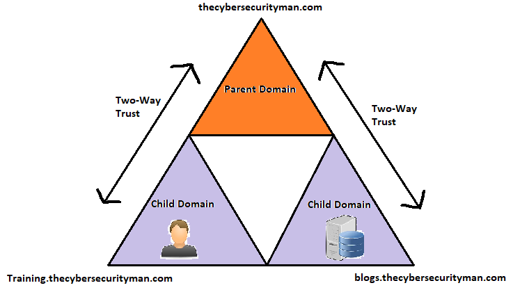
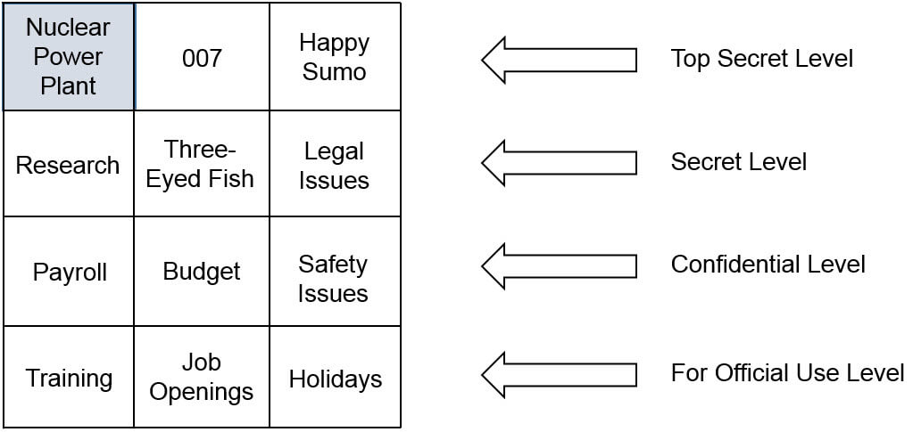

    <a href="#iam">IAM</a>
    <a href="#authentication-factors">Authentication Factors</a>
    <a href="#know">Something you know</a>
    <a href="#have">Something you have</a>
    <a href="#thing">Something you are</a>
    <a href="#where">Somewhere you are</a>
    <a href="#do">Something you do</a>
    <a href="#kerberos">Kerberos/NTLM</a>
    <a href="#ldap">LDAP</a>
    <a href="#sso">SSO</a>
    <a href="#oauth">OAuth/OpenID Connect</a>
    <a href="#management">Account Management Practices</a>
    <a href="#misc">Miscellaneous</a>
    <a href="#control-models">Access Control Models</a>

## Welcome back!

This is the second post in my Security+ Study Guide Notes! In this post we'll be talking about Identity and Access Management (`IAM`), allllll about IAM!

`Note: These posts are in no means meant to be bite-sized content, these will be as detailed and long as I can reasonably make them without writing a whole post on each objective`

## IAM

In short, identity and access management involves the process of a user claiming an identity with a username and proving their identity with `authentication`, their password. They are then granted (`authorized`) access to resources based on their proven identity and permissions groups.

Some identification methods:

- Usernames
- Photo identification cards
- Biometrics 

## Authentication Factors

Authentication is proving you are indeed the real, authentic, you to a computer. A “factor” of authentication is a method of proving who you are to a computer. Authentication is often simplified as types, or factors, of authentication. You may need to implement one factor of authentication for basic authentication, two factors for more secure authentication, or more factors for even higher security. Factors include:

- Something you know, such as a password 
- Something you have, such as a smart card or USB token
- Something you are, such as a fingerprint
- Somewhere you are, such as your location via GPS
- Something you do, such as a gesture on a smartphone

## Something you Know - Passwords

`Something you know` authentication factor refers to a shared secret, password, or PIN. And it is the least secure form of authentication :( Surprising right? Given alllllll the confidential information you have about yourself out in the intertubes that is ONLY protected by a password. You can increase the security of a password by following a few guidelines, you may already know where we’re going with this. Given recent events such as Maga2020! and any security training you’ve been forced to endure at your work hehe. Make your passwords more complex! I know Trump tried here with his but come on, he probably has that tattooed on his butt cheek.

A strong password is sufficient in length, doesn’t include any words found in a dictionary or your campaign slogan, no part of a user’s name, and combines at least 3-4 of these character types:

- Uppercase characters

- Lowercase characters

- Numbers

- Special characters - maybe `MaGA2otw00!1` would’ve been a better idea, huh? (Please don’t make use of this password, this was a joke, I feel like variations on Maga2020! are already in some lists being used to crack into more accounts, if not they’re now on mine! 😈 )

Now, let’s say you’ve updated your password to follow the above guideline, you now have a *complex* password, but it’s still not a *strong* password (even if the text under the password field is saying it’s strong!) We also need to bump up the length of your password so it’s sufficiently *LONG*. In 2016, Microsoft recommended a password length of at least 14 characters, however we’re nearly into 2021 now! The longer the better, and use a password manager while you’re at it so you’re not forced to remember the mumbo-jumbo.

`Key space` is the combination of different characters in a password, you can calculate this with: `C^N(CN). C is the number of possible characters used, and N is the length of the password. A 6-character password using only lowercase letters (max 26 possible) is 26^6(266) = 308 million possibilities. While this may seem like a lot, if you bump your length up to 10 characters, you’re at 141 TRILLION possibilities. There are plenty of password-cracking tools out there in use that can try 20 billion passwords per second, I bet you’re thinking your password is pretty insecure right now, aren’t you? To achieve a long, complex password you can use a passphrase instead such as MaGA2otw00!1 or 1Wi1lp@s$. I personally prefer having a sentence or phrase and taking the first letter or couple letters out of it to create the password, to me that’s more memorable than a passphrase made up of different character types.

Also be sure to change your password regularly, such as every 45-90 days. 

Many users that are forced to change their password regularly, through administrative or technical policies, simply change the password back to an older or only slightly modified version. This is where password history systems come into play, they remember past passwords and prevent users from reusing them. It’s common to remember the last 24 passwords.

When resetting forgotten passwords, it’s important to have a recovery procedure in place that avoids manual resets. If someone in the IT department manually resets a password, it poses a security issue because now two people know the password. It’s also possible for an attacker to trick someone into resetting a password using social engineering.

#### Group Policy

Group Policy is a technical control, if you remember access control classifications back from chapter 1, it allows an administrator to configure a setting once in a Group Policy Object (`GPO`) and apply this setting to many users and computers within the domain, implemented on a domain controller within the domain. You can use Group Policy to create password policies, implement security settings, configure host-based firewalls, and so much more! It doesn’t matter if you have 10 systems or 10,000 systems, the policy still only needs to be set once to apply to all systems in the domain. Administrators can also use Group Policy to target specific groups of users or computers and organize them into organizational units (`OUs`). Then they can create a GPO, link it to that specific OU, and those settings only apply to the users and computers within the OU, handy right?

Some settings for a password policy:
- Enforce password history

- Maximum password age

- Minimum password age - this can be used in conjunction with password history enabled, to discourage users from resetting their password 24 times at once just to get back to their usual memorable password

- Minimum password length

- Password must meet complexity requirements

- Store passwords using reversible encryption - Reversible encryption stores the password in such a way that the original password can be discovered. This is rarely enabled

#### Lockout Policies

Lockout policies prevent users from guessing the password, they’re locked out after X amount of failed attempts. My goodness whatever you do, please ensure this is applied, brute-forcing passwords is real and incredibly easy with relatively no effort required!
- Account lockout threshold  - The maximum number of times a user can enter the wrong password before being locked out

- Account lockout duration - How long the account remains locked, if set to 0 the account remains locked until an administrator unlocks it

Fun fact, in many systems, the administrator account can’t be locked out no matter how many failed login attempts there are, so an attacker can continuously guess the password until they’re in. A good rule of thumb is to change the name of the administrator account to something else to avoid this problem, if they don’t know the name, they can’t try the password! Some admins even fool potential attackers by creating a dummy account that has no permissions and is named “administrator” muahaha. If someone tries to login to this account and locks it, the real slim shady (hehe) will be alerted of the illicit activity.

## Something you Have - Smart Cards, Authenticators

`Something you have` authentication factor refers to something you can physically hold. Again, if you play WoW you may have the physical token authenticator (which they no longer manufacture :( ) this would fall under the something-you-have authentication factor.

#### SMART CARDS

- Smart Cards - these are credit card-sized cards that have an embedded microchip and certificate. Users can insert them into a card reader, similarly to how you would use a chipped credit card at checkout. The card reader reads the information on the card, including the details of the certificate, which provides certificate-based authentication	

- Certificates - these will be covered in more detail in a later chapter, but for now, they are digital files that support cryptography for increased security. The certificate embedded in the smart card allows for the use of a complex encryption key and provides more secure authentication than a password would. Certificates can also be used with digital signatures and data encryption.

All in all, smart cards provide confidentiality, integrity, authentication, and non-repudiation. A smart card must include both an `embedded certificate`, which holds the user’s private key, and the `PKI` which if you remember from chapter 1 is the Public Key Infrastructure, which is what issues and manages certificates.

Smart Cards tend to be used in conjunction with another authentication factor such as a password or PIN, thus providing `dual-factor authentication`. Ya know, like two-factor auth? I bet you didn’t really think twice about the name of that before did you… just me? Ok. Dual-factor authentication is making use of 2 different factors of authentication, while `multifactor authentication` is making use of 2 or more.

#### CACs and PIVs

`CAC` is a Common Access Card, which is a specialized kind of smart card that is used by the US DoD. It has all the capabilities of a smart card, but it also includes a picture of the authorized user and some other information. It can be used as a form of photo identification to gain access to a secure location.

`PIV` stands for a Personal Identity Verification card and it’s another specialized smart card used by other US federal agencies. It also includes photo ID, provides confidentiality, integrity, authentication, and non-repudiation just like CACs. They both support dual-factor authentication via a password and they have embedded certificates used for digital signatures and encryption.

#### Tokens or Key Fobs

A `token`, sometimes called a `key fob`, is an electronic device similar in size to a car remote. They include an LCD screen that displays a number which changes periodically, again if you play WoW you probably either have one or know of someone who does. The token is synced with a server that knows what the number displayed is at any given moment, this number is a one-time use, rolling password, so it isn’t useful to attackers for very long even if they can figure out what the number is by looking over your shoulder.

Tokens provide dual-factor authentication for users logging in with a username/password, so an extra layer of security here. Fun fact that’s fairly irrelevant to this post but hey I’m excited for Shadowlands. My guild mandates every member have either the physical token authenticator or the app attached to their account in order to maintain a member+ status within the guild. It gets messy if your account is hacked and stolen when you have elevated access to the guild bank! It’s the same concern for businesses! They don’t want their trusted employees to be taken advantage of, best to maintain security to the best of everyone’s abilities.

#### HOTP and TOTP

HOTP - (Hash-based Message Authentication Code) HMAC-based One-Time Password (`HOTP`), this uses a hash function and a cryptographic key for a variety of cryptographic functions. HTOP is an open source standard used for creating one-time passwords, similar to what you use tokens or key fobs for. Its algorithm combines a secret key with an incrementing counter and uses HMAC to create a hash of the result. The result is then converted into an HTOP value of 6-8 digits. Unlike tokens, a password created with HTOP remains valid until it’s used. There are a few websites that allow you to share data with another person and link it to them along with a one-time password, I can’t say for sure whether or not it’s using HTOP to create the passwords but it’s a good thing to keep in mind to remember how HTOP works!

While it seems cool and useful that the HTOP password doesn’t expire until use, it does create a security risk if someone requests one and forgets to use it, it’s just floating about waiting for an attacker to find it. You may be able to guess where we’re going here…. `TOTP`! This stands for a Time-based One-Time Password, it’s another open source standard for creating one-time passwords. It’s very similar to HTOP but it uses a timestamp instead of a counter, these typically expire after 30 seconds (more inline with what both Blizzard authenticators do)

## Something you Are - Biometrics 🧬 

This authentication factor is all about using biometrics for authentication, sounds very futuristic and exciting doesn’t it? This is the strongest individual method of authentication, because it’s so difficult for an attacker to falsify… unless they duplicate your fingerprints, or even cut off limbs or eyeballs. 

Biometrics use physical characteristics about a person, such as their fingerprint, for authentication. It’s a two-step process, first the users need to register with the authentication system, giving it your fingerprint and associating it with your own identity, so that it can later use that reference to your fingerprint as a baseline to confirm you are who you say you are. Nowadays we have so many different biometric scanners we can use for authentication, here are just a few, I’m sure there are fancier ones out there that are in the works!

- Fingerprint scanners - lots of phones, laptops, and tablets use these nowadays to authenticate users. They’re able to store multiple fingerprints as well, of either the same person or various users. I’m sure we’ve all seen in recent movies how fingerprint scanners can be fooled though! Biometric data is still your personal confidential data, protect it.

- Retina scanners - these scan the retina or one or both eyes and match the pattern of blood vessels at the back of the eye. Some people are against the use of these because they can also be used to identify medical issues. Imagine if your workplace mandated retina scanners for daily life in the office, your employer may know something about your medical information that even you don’t know about. Now think of the implications, especially if you have employer-provided health insurance… 👀

- Iris scanners - these use camera technologies to capture the patterns of the iris around the pupil. If you live in the EU and have one of those cards that exempt you from checking your passport at customs, you’ve probably gone through and had your iris scanned to confirm your identity instead, I bet you loved how fast that was instead of typical customs! Unlike with retina scanners, you don’t need physical contact for the scan, iris scanners can work anywhere from 3-10 inches away from your eyeball.

- Voice recognition - we’re all too familiar with this nowadays, but I bet you didn’t know how it worked. Each person’s voice varies from another person due to the differences in their mouth and throat, along with behavioral patterns that affect their speaking style, this goes deeper than just having a dialect or accent.

- Facial recognition - uses size of a person’s face in comparison to the rest of their body, size/shape/position of eyes, nose, mouth, cheekbones, and jaw. This can be inaccurate in some lighting, however, some software such as Windows Hello use infrared to compensate for this.

Biometrics are awesome for authentication, however, when implemented inaccurately by manufacturers looking to take shortcuts and cut costs, false readings occur. 

- False acceptance - When a biometric system incorrectly identifies an unauthorized user as the authorized user. `FAR`, false acceptance rate, identifies the percentage of times false acceptance happens.

- False rejection - When a biometric system incorrectly rejects an unauthorized user, I’m sure everyone has had their phone reject their fingerprint a few times. The false rejection rate, `FRR`, identifies the percentage of times false rejection occurs

Biometric systems allow you to adjust the sensitivity, and when increasing the sensitivity to reduce the amount of false acceptances, you inadvertently increase the number of false rejections, think of this as being too strict. On the other hand, if you decrease the sensitivity, making it more of a laid back system, you reduce the number of false rejections but let a lot more false acceptances slide. Now, if you plot this all on a graph, you’d see there’s a point where the false acceptances and rejections intersect, this is called the *crossover error rate* `CER`. A lower CER indicates that the system is more accurate.

## SomeWHERE you Are - Geolocation, MAC Address

Geolocation is made up of technologies used to identify a person’s physical location and is the most common method used in this authentication factor. You can use the IP address for geolocation, it provides information on the country, region, state, city, and sometimes the postcode. This isn’t foolproof though, in fact it’s actually very prone to spoofing. Even if you’re new to tech, you may have at one point used a VPN to change your IP address to another country in order to watch Eurovision in high school…. Man you’re learning a lot about me through this study guide, don’t judge! 

Also look into MAC addresses and how they can be used to limit authentication 😉 we'll talk about this more in the next post!

## Something you Do - Gestures

This authentication factor refers to something you do, such as any gestures on a touch screen. I don’t think I’ve ever touched a Windows phone, but Windows 10 supports picture passwords, these are essentially photos you select and can register 3 gestures with, such as touching a corner or circling an item in the photo, etc.

Other examples of this authentication factor include how you write or type, things such as the speed, dwell time, and flight time of your typing on a keyboard, this also falls under behavioral biometrics because it is identifying behavioral traits of a person.

## Kerberos

Kerberos is a network authentication protocol/mechanism used in Windows Active Directory domains, and implementations of it exist in Apple OS, FreeBSD, and some Unix/Linux environments known as ‘realms’. It provides `mutual authentication` that can help prevent `man-in-the-middle attacks` and uses tickets to help prevent `replay attacks`. Both of these attacks will be covered in more detail in a future post. It uses `symmetric key cryptography` and requires trusted third-party authorization to verify user identities. It requires THREE separate entities to authenticate, so it has a good track record of making things safer.

The name stems from an ancient myth, Kerberos, we commonly call him Cerberus. He guards the Gates to the Underworld and is a big 3-headed dog with a snake for a tail and very bitey. Don’t be fooled though, Kerberos can be hacked!

Note: `Symmetric key cryptography` uses a single key for both encryption and decryption of the same data.

Kerberos has several requirements for it to work properly:

- First of all, you may be wondering what a `ticket` is in this situation, just like I was. In short, a kerberos ticket is a certificate issued by an authentication server, and encrypted using the Ticket Granting Service (`TGS`) secret key. It provides authentication for users when they access resources such as files on a file server. Sometimes referred to as tokens, but they are logical tokens not the tokens from the ‘Something You Have’ authentication factor.
- A method of issuing tickets used for authentication - The `KDC`, Key Distribution Center, has a complex process of issuing ticket-granting tickets (`TGT`) and other tickets. The KDC/TGT server packages user credentials within a ticket.
- Time synchronization - Kerberos requires all systems to be synchronized within 5 minutes of each other. The clock is used to timestamp tickets, ensuring they expire correctly, preventing a `replay attack`, which is when a third party attempts to impersonate a client after intercepting any data captured in a session. With Kerberos, if an attacker intercepts a ticket, the timestamp limits the amount of time left the attacker can use it before it’s invalid.
- A database of users - This would be the Active Directory if you’re in a Microsoft environment.

In a basic Kerberos environment, it goes a little something like this:
1. User logs on with Kerberos, the KDC issues the user a TGT with a limited lifetime of ~10 hours or some reasonable amount of time like a typical workday.
2. When a user attempts to access a resource, the TGT is presented as authentication, and the user is issued another ticket for the resource.
3. If the user stays logged on for too long, the ticket will expire, preventing them from accessing the network resources. They may be prompted to enter a password to renew the TGT or they may need to relog in order to generate a new TGT.

How can Kerberos be hacked?

Because Kerberos is one of the most widely used authentication protocols, *of course* attackers have found several ways of cracking into it. They take advantage of vulnerabilities, weak passwords, malware, sometimes all three! Here are a few of the most successful methods, please do more research on them, especially if one stands out as exceptionally interesting!
Pass-the-ticket - this is the process of forging a session key and presenting that forged key to the resource as credentials
Golden Ticket - this is a ticket that grants a user domain admin access
Silver Ticket - this is a forged ticket that grants access to a service
Credential stuffing or Brute force - these are both automated continuous attempts at guessing a password
There are many more, do some extra research and get those brain gains! 💪🧠

## NTLM

This stands for New Technology LAN Manager (`NTLM`) and it is a suite of protocols that provide authentication, integrity, and confidentiality within Windows systems. They use a Message Digest hashing algorithm to challenge the users password and check their credentials, and it stores password hashes for continued use. 

There are/have been three versions of NTLM, it’s easy to think of them as iterations, being built better as they go (but still unreliable alone!)
- NTLM is a simple MD4 hash of a user’s password, MD4 has been cracked and neither MD4 nor NTLM are recommended for use nowadays
- NTLMv2 is the challenge-response authentication protocol. When a user logs on, NTLMv2 creates an HMAC-MD5 hash made up of the username, computer name, the password, current time, etc.
- NTLM2 Session adds in mutual authentication. The client authenticates with the server, and the server authenticates with the client.

The biggest difference between NTLM and Kerberos is the third-party verification and stronger encryption within Kerberos, it provides an extra layer of security that NTLM doesn’t have. It’s generally recommended you don’t rely on NTLM to protect sensitive data. 

It’s suggested that developers use the `Negotiate` security package, which actually chooses the most secure protocol available between the systems. It will try to use Kerberos first if it’s available, otherwise either NTLMv2 or NTLM2 Session depending on the system.

## LDAP and LDAPS

`LDAP` stands for Lightweight Directory Access Protocol, it specifies formats and methods to query databases. Microsoft Windows uses Active Directory, which is based on LDAP. It is also a directory of objects and provides a single location for object management.

LDAP is commonly used to provide a central place for authentication, meaning storing usernames and passwords. Then LDAP can be used in various applications or services to validate users with a plugin, such as Docker, Jenkins, Kubernetes, Open VPN, and more.

Fun fact! There is a healthy amount of security professionals that don’t recommend using LDAP for authentication, particularly at scale! More like the scale of AWS… haha. It should be used for its main purpose, ideally, an address book essentially. If you open up the contacts in your Outlook account, that should be the extent of LDAP. It’s a bit of a controversial topic since a lot of people haven’t, nor will ever, have to work with LDAP at such a big scale and handle the daily issues that come with it. 

You can use LDAP in scripts, but you need to know how to identify objects and some basic syntax. Let’s say there’s a user named Sudoh in the Users container of the nichole.is domain. Sudoh would be identified with this LDAP string:

`LDAP://CN=Sudoh,CN=Users,DC=nichole,DC=is`

CN=Sudoh - CN is short for `common name`
CN=Users - CM is sometimes referred to as container in this context
DC=nichole - DC is short for `domain component`
DC=is - This is the second domain component in the domain name

`LDAPS` is LDAP Secure, and it uses encryption to protect LDAP transmissions. When a user connects to a server using LDAPS, both systems establish a Transport Layer Security (`TLS`) session before transmitting any data, TLS will encrypt the data first.

## SSO

Single Sign-On is the ability of a user to log on to multiple systems by providing their credentials only once. This is commonly seen in product suites, think of Google and their services such as gmail, drive, docs, photos, sheets, etc. SSO increases security because the user only needs to remember one set of credentials and it’s less likely they will write them down… or store them in an unencrypted note on their computer. Keep in mind that this aspect makes it more secure, it’s simultaneously a security risk! If it’s just a single set of credentials keeping attackers from accessing all those systems… oooft. Just gonna say this again… PASSWORD MANAGERS, Y’ALL! And strong, complex, passwords. pls. 

There are also networks that provide SSO capabilities, a user only needs to log in to the network once and then any time they access a network resource, the SSO system uses the secure token (created at first sign-on) for authentication. Kerberos and LDAP both include SSO capabilities.

`Same sign-on` is not the same as SSO, in same sign-on the users re-enter their credentials every time they access another system, but they are reusing the SAME credentials.

A `transitive trust` creates an indirect trust relationship… say what now? SSO is a form of `transitive` authentication, which allows users to access other services or systems as long as there is transitive trust. Each system trusts each other. Within an LDAP-based network, domains use transitive trust for SSO.

There’s a two-way trust between the parent domain and the child domain. There is also a two-way trust between the parent domain and the Blogs child domain. There is not a direct trust link between the two child domains, however the *transitive* relationship creates a two-way trust between them

`SAML` - Security Assertion Markup Language is an XML-based data format used for SSO on web browsers. Imagine two separate websites ran by completely separate organizations, if they trust each other or have created a federation, then can use SAML so users who authenticate with one site are automatically authenticated with the second. Similar to the transitive trust relationships within parent and sub domains. The SAML process sends a lot of XML-based messages between the systems and these are usually transparent to the user, they don’t know what all is happening, just that it’s *magic*. SAML has three roles:

- Principal - this is typically a user. They log on once, if necessary the principal requests an identity from the identity provider

- Identity provider - This creates, maintains, and manages identity information for principals

- Service provider - This provides services to principals. It could host one or more web sites that are accessible via a portal. When a principal attempts to access a resource here, they’re redirected by the service provider to obtain an identity first.

SSO is primarily used for identification and authentication of users, it is NOT meant to provide authorization, remember this is the step *after* authentication. Many federation SSO systems and SAML have the ability to *transfer* authorization data between the systems, so it is possible to use SAML for SSO authentication and authorization.

A federated identity links a user’s credentials from different networks or OS’s, but the federation treats it as one identity. `Shibboleth` is an open source federated identity solution.

## OAuth and OpenID Connect

`OAuth` is an open standard for authorization that provides secure access to protected resources. You can use your Google, Facebook (but really, why?). PayPal, Twitter, or Microsoft account to access the web site’s content.

`OpenID Connect` works with OAuth 2.0, it allows clients to verify the identity of end-users without managing their credentials. The client is typically a web site or app that needs to authenticate users. OpenID Connect provides identification services without requiring the application or web site itself to handle the credentials.

## Account Management Practices

Now we’re going to talk a little about common account management practices. Account management is all about the creation, management, disablement, and termination of accounts. When accounts are active, access control methods are used to control what that user can and can't do or access. When administrators don’t follow these practices or configure accounts improperly, it creates security risks.

#### Least Privilege

Least privilege is just that, it’s all about only giving authorized users, or processes, the minimum privileges (rights and permissions) they require in order to get their job done. It falls into the technical control classification of access controls.

#### Need to Know

This principle is similar to lease privilege in that users are only granted access to the data and information they need to know for their job. Need to Know is focussed on data and information, which is typically protected with permissions, and Least Privilege is about rights and permissions.

- Rights - these are actions. So the right to change the system time, right to install an application, etc
- Permissions - these refer to permissions on files, such as read, write, modify, and read & execute

#### Account Types

- End User Accounts - Used for regular users, administrators create these and assign appropriate privileges based on their job responsibility.

- Privileged Accounts - These have additional rights and privileges beyond a regular user. Think of root and sudo. Administrators have access to these elevated rights accounts, but they should always do their day-to-day work with a regular user account to avoid any security risks.

- Guest Accounts - These are useful for if you want to grant someone limited access to a computer or network without creating a new account. Think of temp hires or temp agencies that send a different person every day for a task.

- Service Accounts - Some applications and services need to run under the context of an account, service accounts are what they’ll use. SQL server is a database application that runs on a server and needs access to resources on both the server and network. Administrators will create a regular user account and name it according to the service using it. Service accounts typically aren’t managed, a regular end user account is notified of an upcoming expiration date for the password and can change it, but service accounts won’t respond to that notification so the account becomes locked and services stop working. To avoid this, configure the service accounts so they don’t have to comply with a password policy, but be sure it still follows other policy requirements such as having a strong and complex password.

## Miscellaneous

This section has things we discussed in the previous chapter or things that should be common sense, but I’ll be including them for the sake of giving you everything you need to research!

- Some companies use a standard naming convention for their user accounts, for example nichole.dwight or dwight.nichole, and a second person by that name may be nichole.dwight2. These vary, just check if your company has a standard before creating new accounts. My favorite is how AWS does it, there is no standard! And for good reason, less likely for an attacker to figure out the pattern and spam emails or attempt to login as real employees.
- Don’t use shared or generic accounts. By using them, you lose non-repudiation, you’ll never know which user of a shared account actually deleted the entire company’s data. Remember: *identification, authentication, authorization, and account*!
- Be aware of any disablement policies in place for terminated employees, employees taking a leave of absence, or deleted accounts.
- You can recover accounts by re-enabling a disabled account or recovering a deleted one (complex).
- You can enable time-of-day restrictions on user accounts, preventing them from logging on at certain times.
- There are also location-based policies that restrict access based on where a user is (think back to the “Somewhere You Are” authentication factor!) You can `whitelist` a set of IP addresses that are acceptable. You don’t have to depend on geolocation for this policy, you can restrict machines based on their MAC addresses, this helps ensure employees can only log on by a company-provided machine.
- You can setup accounts to automatically expire at a certain date/time. If you want to extend the expiration, you can just recertify the account. A lot of this is made easier with Linux, rather than using GUIs in Windows, in my honest and inexperienced opinion, I’ve only done this on my own machine with Linux 🙃

## Access Control Models

Do you remember what access controls (AC) are? They help ensure only authenticated and authorized users or processes can access resources. You can grant access to them by using several different models. An access control model determines how a system grants users access to files and other resources.

- Role-based (role-BAC) 

- Rule-based (rule-BAC) 

- Discretionary (DAC) 

- Mandatory (MAC) 

- Attribute-based (ABAC) 

#### Role-Based Access Control

This uses roles to manage rights and permissions for users. Useful for when you have a bunch of users within a department that perform the same job functions, or role. It’s similar to how group permissions work. You would then grant the role access to the appropriate resources, rather than the individual users. This can also be called `hierarchy-based` or `job/task/function-based`. 

#### Rule-Based Access Control

Obviously, this access control uses rules. The most common example is rules in routers or firewalls. The rules define the traffic that the devices allow into the network. Some rules can be dynamic, intrusion prevention systems can detect attacks, and then modify the rules to block the traffic from an attacker.

#### Discretionary Access Control

With this model, every object (files and folders) has an owner that establishes access for the object. In Windows’ NTFS (New Technology File System), it provides security by allowing users and admins to restrict access to files or folders by using permissions. 
	
Microsoft systems identify users with `SIDs` (security identifiers), which is a long string of characters. The system looks up the name associated with the SID and displays that rather than the actual SID. Microsoft also identifies groups with a SID.

Every object includes a Discretionary access control list (`DACL`), which identifies who can access it in a system using the DAC model. It’s a list of Access Control Entries (`ACEs`). An ACE is composed of a SID and the permissions granted to that SID. Some users may have full-control, some may have read-only, and some may have modify/write permissions. All the entries together make up the DACL.

When a user creates a file, they are then the owner of that file and have explicit control over it. They can modify the permissions on the object by adding user or group accounts to the DACL and assigning the appropriate permissions. DAC is more flexible than MAC, MAC has predefined access privileges, and the administrator is required to make the changes.

Be mindful of Trojan horses if you’re using DAC though! A Trojan horse is an executable file, disguised as something useful but in fact is actually full of malware. If a user downloads and installs an application that contains malware, AND they’re logged in with administrative privileges, you’re in for a nightmare. That Trojan is now able to run with the same administrative privileges on your system.

#### Mandatory Access Control

The MAC model uses (sensitivity/security) labels to determine access. Security admins assign labels to both subjects and objects, when the labels match the subject is granted access to the object. This model is used heavily in the military in order to protect data. Think of the movies where you’ve seen a folder marked “Top Secret”, only someone with the Top Secret clearance AND the need to know will be able to access the data inside that folder. Just because someone has the clearance, doesn’t mean they also have the need to know! SELinux is one of the few OSs using the MAC model.

MAC uses what is called a `lattice` to define different levels of security to classify both users and data. It can be a complex relationship between different sets of labels, the `labels` define the boundaries for the security levels.

Say someone has access to the Nuclear Power Plant compartment in the lattice above, they don’t necessarily have access to the 007 compartment or Happy Sumo compartment unless they also have those clearances and associated labels. The higher-level clearances also include lower-level clearances BUT access to data in the lower-levels is still based on the need to know.

#### Attribute-Based Access Control

This access control model evaluates attributes and grants access based on the value of them. Attributes can be almost any characteristic of a user, environment, or the resource. ABAC uses policies to evaluate attributes and grant access when a match in the policy is detected. 

A user’s account may be defined with attributes such as: employee, inspector, and nuclear aware. A file server at the plant they’re employed at has a share called Inspector and it holds files commonly used by nuclear safety inspectors. An ABAC policy for the share would grant access to the share for any subjects that have the 3 attributes this user holds. It’s a match.

Software defined networks (`SDNs`) use ABAC models, instead of rules on physical routers, policies in the ABAC system control the traffic. Typically using plain statements such as “allow logged-on researchers to access research sites via the main network”. Policy statements include 4 elements: the subject, object, action (what the subject is attempting to do), and environment (can include time, location, protocols, encryption, devices, etc).

ABAC can enforce both a DAC and MAC model. In a DAC model, owners have control over the access and in an ABAC model, owners create policies to grant access. MAC uses labels assigned to subjects and objects to grant access when there’s a match, ABAC uses attributes that identify the subject and object and grant access when there’s a match. It’s like a combination of both!

## 🥳 Fin!

Till next time!